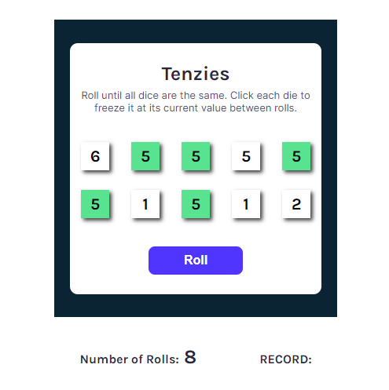

# Tenzies Game

> Tenzies game is a fun game built with React.
>
>The goal is roll the dice until all of them are displaying the same number. The lesser the number of rolls, the better.
>
> [Click Here to play](https://benjamin-tenzies.netlify.app/)



## Live Demo
- [Link to Live Version](https://benjamin-tenzies.netlify.app/)


## Built With

- Major languages (HTML, CSS, JavaScript)

- Frameworks / Libraries
  ```bash
  - React (Frontend library)
  ```

- Technologies used

  ``` bash
  - Git(version control)
  - ESLint(JavaScript linting)
  - Stylelint(style linting)
  ```


## Getting Started

To get a local copy up and running follow these simple example steps.

### Install
  -  [Git](https://git-scm.com/downloads)
  -  [Node](https://nodejs.org/en/download/)


### Clone this repository

```bash
$ git@github.com:BenjaminSemah/tenzies-game.git
$ cd tenzies-game
```
### Run project

```bash
$ npm install
$ npm build
$ npm start
```

### Open page in browser
```bash
$ runs on http://localhost:3001/
```

## Author

👤 **Benjamin Semah**

- GitHub: [Benjamin Semah](https://github.com/BenjaminSemah)
- Twitter: [Benjamin Semah](https://twitter.com/BenjaminSemah)
- LinkedIn: [Benjamin Semah](https://www.linkedin.com/in/benjaminsemah)

## 🤝 Contributing

Contributions, issues, and feature requests are welcome!

Feel free to check the [issues page](https://github.com/BenjaminSemah/tenzies-game/issues).


## Show your support

Give a ⭐️ if you like this project!

## 📝 License

This project is [MIT](https://opensource.org/licenses/MIT) licensed.
